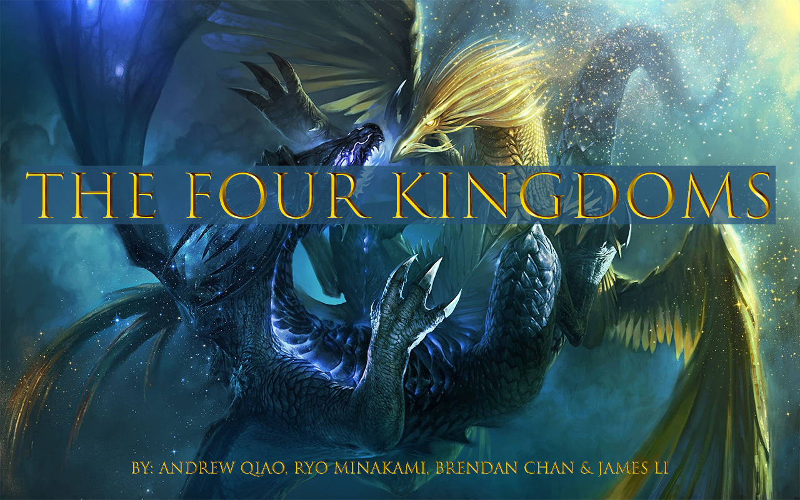

# The Four Kingdoms
A fantasy/medieval style simulation, created for my ICS4U class. Enjoy!

Website: [The Four Kingdoms](https://sites.google.com/view/the-fourkingdoms)

## A Quick Overview...
As the name suggests, the simulation includes four kingdoms, one situated in each corner. At the beginning, kingdoms are divided into two alliances and each kingdom includes a chateau, two treasuries to produce money, and two garrisons to produce troops. The troops, the Serpentine and the Dragon, are used to destroy the establishments of the other kingdoms. Once an alliance is wiped out, meaning their chateau has been destroyed, new alliances will be formed, continuing until there is one kingdom left.
