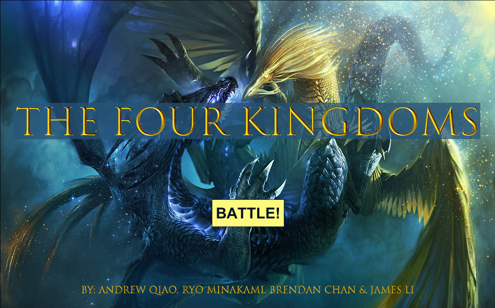
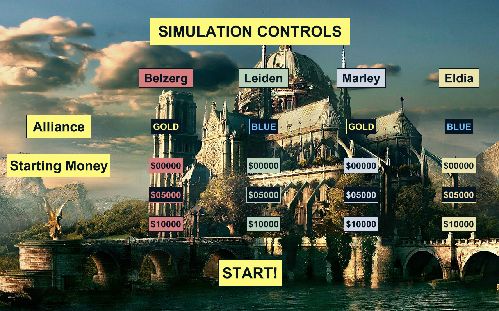
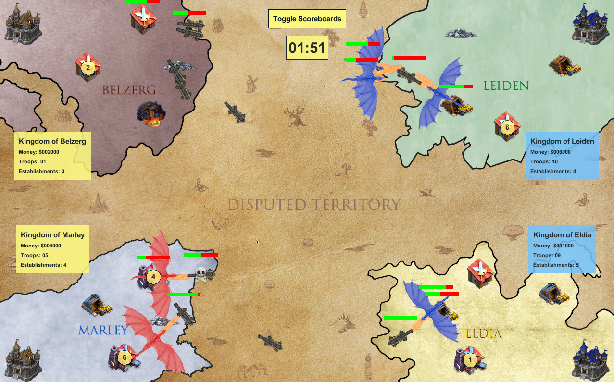

# The Four Kingdoms
A fantasy/medieval style simulation, created for my ICS4U class. Enjoy!

Visit the website! [The Four Kingdoms](https://sites.google.com/view/the-fourkingdoms)

## A Quick Overview...
As the name suggests, the simulation includes four kingdoms, one situated in each corner. At the beginning, the four kingdoms are divided into two alliances, blue and gold.

Users have the option in the control screen to determine which kingdoms belong to which alliance, as well as the starting amount of money each kingdom has.

Each kingdom starts off with a chateau, two treasuries, and two garrisons. The role of the chateau is to act as the center of command for the kingdom, determining when to upgrade establishments or create troops. Treasuries, on the other hand, create money for the kingdom. This money can then be used to create troops or upgrade establishments. Finally, the garrion has the role of training the troops.

The troops, the serpentine and the dragon, are used to destroy the establishments of the other kingdoms. Once the chateau of a kingdom has been destroyed, all its troops, along with its other establishments will be destroyed as well, wiping out the kingdom.

If an alliance is wiped out, meaning all the chateaus of the kingdoms belonging to an alliance have been destroyed, new alliances will be formed, continuing until there is one kingdom left.
